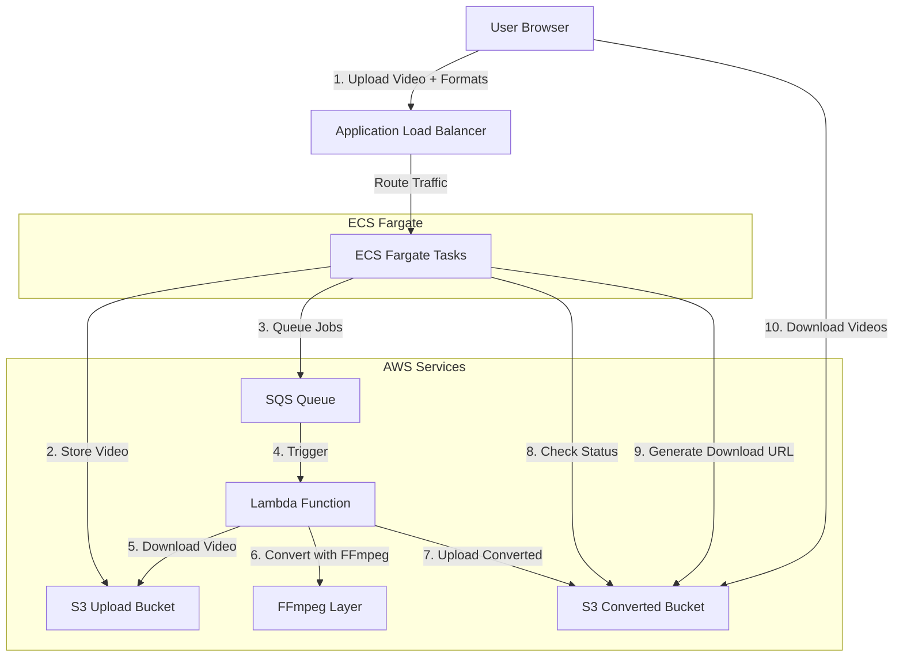
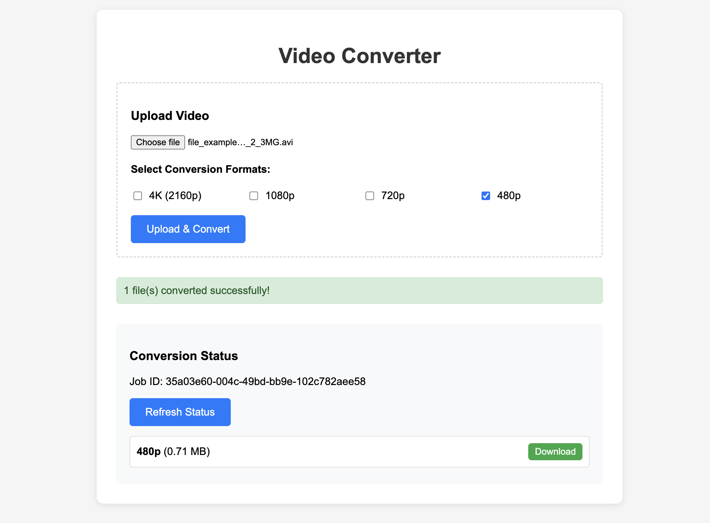

# Video Processing Application

## Project Architecture



## Components Flow:
1. User uploads video via web UI and selects conversion formats
2. FastAPI receives upload, stores in S3, sends conversion job to SQS
3. SQS triggers Lambda function for each conversion format
4. Lambda downloads video, converts using FFmpeg, uploads back to S3
5. User can check conversion status via FastAPI endpoint

## UI


## Setup Instructions

### 1. AWS S3 Buckets
```bash
# Create buckets (replace with unique names)
aws s3 mb s3://video-upload-bucket-unique
aws s3 mb s3://video-converted-bucket-unique
```

### 2. AWS SQS Queue
```bash
aws sqs create-queue --queue-name video-conversion-queue
```

### 3. IAM Role for Lambda
Create role with policies:
- AmazonS3FullAccess
- AmazonSQSFullAccess
- AWSLambdaBasicExecutionRole

### 4. Lambda Layer for FFmpeg
Download FFmpeg static build and create layer:
```bash
mkdir ffmpeg-layer/bin
# Download FFmpeg static binary to ffmpeg-layer/bin/
zip -r ffmpeg-layer.zip ffmpeg-layer/
aws lambda publish-layer-version --layer-name ffmpeg --zip-file fileb://ffmpeg-layer.zip
```

### 5. Environment Variables
Set in Lambda and FastAPI:
- UPLOAD_BUCKET=video-upload-bucket-unique
- CONVERTED_BUCKET=video-converted-bucket-unique
- SQS_QUEUE_URL=your-sqs-queue-url