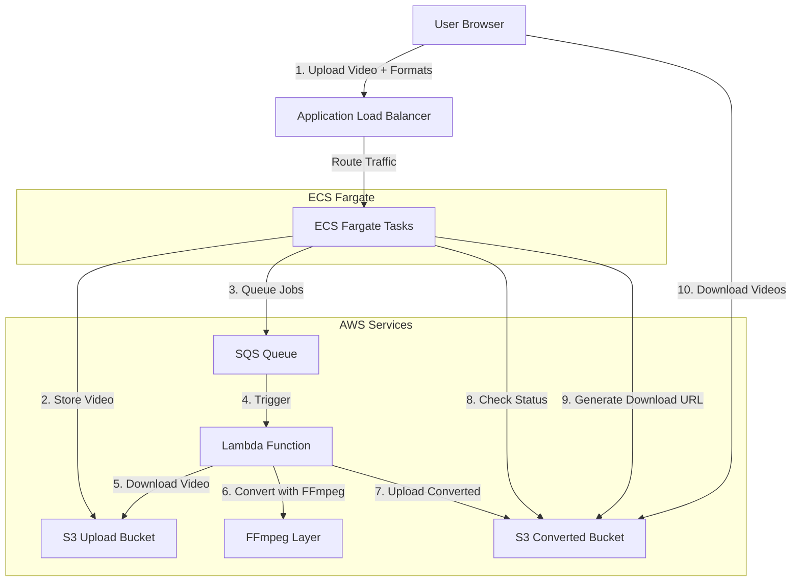
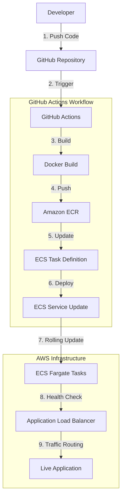

# Video Converter - System Architecture

## Application Flow



## Detailed Application Architecture

```
┌─────────────────┐    ┌──────────────────┐    ┌─────────────────┐
│   User Browser  │    │  Application     │    │  ECS Fargate    │
│                 │    │  Load Balancer   │    │  Tasks (2x)     │
│  - Upload UI    │◄──►│                  │◄──►│                 │
│  - Status Check │    │  - Port 80       │    │  - FastAPI      │
│  - Download     │    │  - Health Check  │    │  - Port 8000    │
└─────────────────┘    └──────────────────┘    └─────────────────┘
                                                        │
                       ┌─────────────────────────────────┼─────────────────────────────────┐
                       │                                 │                                 │
                       ▼                                 ▼                                 ▼
            ┌─────────────────┐              ┌─────────────────┐              ┌─────────────────┐
            │  S3 Upload      │              │  SQS Queue      │              │ S3 Converted    │
            │  Bucket         │              │                 │              │ Bucket          │
            │                 │              │ - Job Messages  │              │                 │
            │ - Original      │              │ - Batch Size: 1 │              │ - Converted     │
            │   Videos        │              │ - Visibility    │              │   Videos        │
            │                 │              │   Timeout: 900s │              │ - Multiple      │
            └─────────────────┘              └─────────────────┘              │   Formats       │
                                                        │                     └─────────────────┘
                                                        │
                                                        ▼
                                             ┌─────────────────┐
                                             │ Lambda Function │
                                             │                 │
                                             │ - Python 3.9    │
                                             │ - 5min Timeout  │
                                             │ - 1GB Memory    │
                                             │ - FFmpeg Layer  │
                                             └─────────────────┘
```

## Deployment Flow



## Infrastructure Components

### Compute Layer
```
┌─────────────────────────────────────────────────────────────┐
│                    ECS Fargate Cluster                     │
├─────────────────────────────────────────────────────────────┤
│  Service: video-converter-service                           │
│  ├─ Desired Count: 2                                        │
│  ├─ Task Definition: video-converter-task                   │
│  ├─ CPU: 0.5 vCPU                                          │
│  ├─ Memory: 1GB                                            │
│  ├─ Network Mode: awsvpc                                   │
│  └─ Auto Scaling: 1-10 tasks                              │
│                                                             │
│  Container: video-converter                                 │
│  ├─ Image: ECR Repository                                   │
│  ├─ Port: 8000                                             │
│  ├─ Environment: Parameter Store                           │
│  └─ Health Check: /health endpoint                         │
└─────────────────────────────────────────────────────────────┘
```

### Network Layer
```
┌─────────────────────────────────────────────────────────────┐
│                      VPC (Default)                         │
├─────────────────────────────────────────────────────────────┤
│  Application Load Balancer                                  │
│  ├─ Scheme: Internet-facing                                 │
│  ├─ Listener: Port 80 → Target Group                       │
│  ├─ Health Check: /health                                   │
│  └─ Subnets: Multi-AZ (us-east-1d, us-east-1e)           │
│                                                             │
│  Security Group: video-converter-sg                         │
│  ├─ Inbound: Port 80 (0.0.0.0/0)                          │
│  ├─ Inbound: Port 8000 (0.0.0.0/0)                        │
│  └─ Outbound: All traffic                                   │
│                                                             │
│  Target Group: video-converter-tg                           │
│  ├─ Protocol: HTTP                                          │
│  ├─ Port: 8000                                             │
│  ├─ Target Type: IP                                         │
│  └─ Health Check: /health                                   │
└─────────────────────────────────────────────────────────────┘
```

### Storage Layer
```
┌─────────────────────────────────────────────────────────────┐
│                        S3 Buckets                          │
├─────────────────────────────────────────────────────────────┤
│  Upload Bucket: video-upload-bucket-*                       │
│  ├─ Purpose: Store original videos                          │
│  ├─ Access: ECS tasks (upload)                             │
│  └─ Lifecycle: Optional cleanup policy                      │
│                                                             │
│  Converted Bucket: video-converted-bucket-*                 │
│  ├─ Purpose: Store converted videos                         │
│  ├─ Access: ECS tasks (read), Lambda (write)               │
│  └─ Structure: {job_id}/{filename}_{format}.mp4            │
└─────────────────────────────────────────────────────────────┘
```

### Processing Layer
```
┌─────────────────────────────────────────────────────────────┐
│                    Lambda Function                         │
├─────────────────────────────────────────────────────────────┤
│  Function: video-converter                                  │
│  ├─ Runtime: Python 3.9                                    │
│  ├─ Memory: 1024 MB                                        │
│  ├─ Timeout: 300 seconds (5 minutes)                       │
│  ├─ Trigger: SQS Queue                                     │
│  └─ Layer: FFmpeg static binary                            │
│                                                             │
│  SQS Queue: video-conversion-queue                          │
│  ├─ Visibility Timeout: 900 seconds                        │
│  ├─ Batch Size: 1                                          │
│  ├─ Dead Letter Queue: Optional                            │
│  └─ Message Format: JSON job specification                 │
└─────────────────────────────────────────────────────────────┘
```

## Security & IAM

### IAM Roles
```
┌─────────────────────────────────────────────────────────────┐
│                      IAM Roles                             │
├─────────────────────────────────────────────────────────────┤
│  ecsTaskExecutionRole                                       │
│  ├─ AmazonECSTaskExecutionRolePolicy                       │
│  ├─ AmazonSSMReadOnlyAccess                                │
│  └─ Purpose: Pull images, read Parameter Store             │
│                                                             │
│  VideoConverterTaskRole                                     │
│  ├─ AmazonS3FullAccess                                     │
│  ├─ AmazonSQSFullAccess                                    │
│  └─ Purpose: Application AWS API access                    │
│                                                             │
│  VideoConverterLambdaRole                                   │
│  ├─ AWSLambdaBasicExecutionRole                            │
│  ├─ AmazonS3FullAccess                                     │
│  ├─ AmazonSQSFullAccess                                    │
│  └─ Purpose: Lambda execution permissions                   │
└─────────────────────────────────────────────────────────────┘
```

### Configuration Management
```
┌─────────────────────────────────────────────────────────────┐
│                  Parameter Store                            │
├─────────────────────────────────────────────────────────────┤
│  /video-converter/upload-bucket                             │
│  /video-converter/converted-bucket                          │
│  /video-converter/sqs-queue-url                            │
│                                                             │
│  Purpose: Secure environment variable storage              │
│  Access: ECS tasks via task execution role                 │
└─────────────────────────────────────────────────────────────┘
```

## Monitoring & Logging

### CloudWatch Integration
```
┌─────────────────────────────────────────────────────────────┐
│                    CloudWatch                              │
├─────────────────────────────────────────────────────────────┤
│  Log Groups                                                 │
│  ├─ /ecs/video-converter (ECS task logs)                   │
│  └─ /aws/lambda/video-converter (Lambda logs)              │
│                                                             │
│  Metrics                                                    │
│  ├─ ECS: CPU, Memory, Task count                           │
│  ├─ ALB: Request count, Response time                       │
│  ├─ Lambda: Duration, Errors, Invocations                  │
│  └─ SQS: Messages visible, Messages sent                   │
│                                                             │
│  Alarms (Optional)                                          │
│  ├─ High CPU utilization                                    │
│  ├─ Lambda errors                                           │
│  └─ SQS message age                                         │
└─────────────────────────────────────────────────────────────┘
```

## Data Flow Sequence

### Video Upload & Conversion
```
1. User uploads video via web interface
2. FastAPI receives file and format selection
3. Video stored in S3 upload bucket
4. Job messages sent to SQS (one per format)
5. SQS triggers Lambda function for each job
6. Lambda downloads video from S3
7. FFmpeg converts video to specified format
8. Converted video uploaded to S3 converted bucket
9. User polls status endpoint
10. FastAPI checks S3 for converted files
11. User downloads via presigned URLs
```

### Deployment Pipeline
```
1. Developer pushes code to GitHub
2. GitHub Actions triggered on main branch
3. Docker image built and tagged
4. Image pushed to Amazon ECR
5. ECS task definition updated with new image
6. ECS service performs rolling update
7. Health checks ensure new tasks are healthy
8. Traffic gradually shifted to new tasks
9. Old tasks terminated after successful deployment
```

## Scalability & Performance

### Auto Scaling Configuration
```
┌─────────────────────────────────────────────────────────────┐
│                   Auto Scaling                             │
├─────────────────────────────────────────────────────────────┤
│  ECS Service Auto Scaling                                   │
│  ├─ Min Capacity: 1 task                                    │
│  ├─ Max Capacity: 10 tasks                                  │
│  ├─ Target CPU: 70%                                         │
│  └─ Scale-out cooldown: 300s                               │
│                                                             │
│  Lambda Concurrency                                         │
│  ├─ Reserved: None (uses account limit)                     │
│  ├─ Concurrent executions: Up to 1000                      │
│  └─ Processing time: 5 minutes max per video               │
└─────────────────────────────────────────────────────────────┘
```

## Cost Optimization

### Resource Sizing
```
┌─────────────────────────────────────────────────────────────┐
│                  Cost Breakdown                            │
├─────────────────────────────────────────────────────────────┤
│  ECS Fargate (2 tasks, 0.5 vCPU, 1GB)                     │
│  ├─ Monthly: ~$60                                           │
│  └─ With auto-scaling: $30-120/month                       │
│                                                             │
│  Lambda (video processing)                                  │
│  ├─ Per request: $0.0000166667 per GB-second               │
│  └─ Depends on video size and processing time              │
│                                                             │
│  S3 Storage                                                 │
│  ├─ Standard: $0.023 per GB/month                          │
│  └─ Requests: $0.0004 per 1000 PUT requests                │
│                                                             │
│  Application Load Balancer                                  │
│  └─ Fixed: $16.20/month + $0.008 per LCU-hour             │
└─────────────────────────────────────────────────────────────┘
```